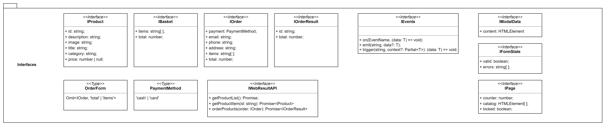

# Проектная работа "Веб-ларек"

Стек: HTML, SCSS, TS, Webpack

Структура проекта:

- src/ — исходные файлы проекта
- src/components/ — папка с JS компонентами
- src/components/base/ — папка с базовым кодом

Важные файлы:

- src/pages/index.html — HTML-файл главной страницы
- src/types/index.ts — файл с типами
- src/index.ts — точка входа приложения
- src/styles/styles.scss — корневой файл стилей
- src/utils/constants.ts — файл с константами
- src/utils/utils.ts — файл с утилитами

## Установка и запуск

Для установки и запуска проекта необходимо выполнить команды

```
npm install
npm run start
```

или

```
yarn
yarn start
```

## Сборка

```
npm run build
```

или

```
yarn build
```

## Описание данных



### IAppState

Интерфейс представляет собой общую структуру данных, которая содержит информацию о состоянии всех компонентов приложения.

### IFormState

Интерфейс содердержащий поля для отслеживания валидности введенных пользователем данных.

### IProduct

Описывает структуру которая содержится у продукта. Интерфейс будет использоваться для создания продукта получаемого с сервера.

### IOrderForm

Описывает структуру в полей ввода для подтверждения заказа. Интерфейс будет использоваться для заполнения полей ввода при создании заказа.

### IOrder

Описывает структуру содержания заказа и его конечную стоимость. Данный интерфейс будет наследовать поля IOrderForm. Интерфейс будет использоваться для отправки на сервер уже сформированного заказа(все поля интерфейса IOrderForm должны быть заполнены).

### IOrderResult

Данный интерфейс содержит идентификатор созданного заказа. Интерфейс созданный для того чтобы понять в конце клиентского пути оформлен ли заказ или нет.

### Интерфейсы для моделей данных

### IPageModel

#### Интерфейс содержит:

- <code>counter</code> - счетчик который неоходим для отображения количества товаров в корзине.
- <code>catalog</code> - каталог товаров.
- <code>loadProducts</code> - метод для получения товаров из API.
- <code>onClick</code> - метод созданный для открытия модального при нажатии на товар.

### ICardModel

Интерфейс содержит поля необходимые для отображения подробной информации о товаре и метод <code>onClick</code> созданный для перехода в корзину.

### IBacketModel

#### Интерфейс содержит:

- <code>products</code> - массив добавленных в корзину продуктов.
- <code>total</code> - итоговая цена товаров.
- <code>deleteProduct</code> - итоговая цена товаров.
- <code>onClick</code> - метод созданный для перехода на следующий шаг оформления заказа.

### IModalModel

#### Интерфейс содержит:

- <code>content</code> - поле для хранения карточки(интерфейса) товара.
- <code>open</code> - метод открытия модального окна.
- <code>close</code> - метод закрытия модального окна.

## Модели данных

[Архитектура приложения](architecture.drawio)


### Класс <code>Component</code>

Базовый класс предназначен для управления компонентом.

- <code>render</code> - предназначен для отрисовки компонента.
- <code>setText</code> - предназначен для установки текста внутри текстовых полей.
- <code>setImage</code> - предназначен для установки изображения.
- <code>setDisabled</code> - устанавливает кнопке атрибут disabled.
- <code>setHidden</code> - скрывает передаваемый элемент.
- <code>setVisible</code> - показывает передаваемый элемент.
- <code>toggleClass</code> - предназначен переключения классов у элемента.

### Класс <code>Model</code>

Абстрактный класс определяющий базовую структуру для моделей в приложении. Необходим для работы с данными в приложении,управлением состоянием.

### Компоненты представления

### Basket

Будет наследовать <code>Component</code>.
Содержит:

- <code>list</code> - элемент разметки содержащий список добавленных в корзину товаров.
- <code>total</code> - элемент разметки содержащий итоговую стоимость.
- <code>button</code> - элемент разметки содержащий кнопку для оформления заказа.
- <code>setItems</code> - метод принимающий элементы разметки(товары) и формирующий list.
- <code>setTotal</code> - метод принимающий число, и устанавливающий итоговую стоимость в элемент разметки.

### Form

Будет наследовать <code>Component</code>
Содержит:

- <code>submit</code> - элемент разметки(кнопка), дающая возможность перейти на следующий шаг оформления заказа.
- <code>errors</code> - элемент разметки содержащий итоговую стоимость.
- <code>onInputChange</code> - метод который генерирует событие о изменении значения поля.
- <code>render</code> - метод который обновляет состояние компонента на основе переданного состояния.
- <code>setErrors</code> - метод принимающий строку и устанавливает ее в переменную errors.
- <code>setValid</code> - метод принимающий "булевое" значение и включающий кнопку submit.

### Modal

Будет наследовать <code>Component</code>
Содержит:

- <code>closeButton</code> - элемент разметки содержащий кнопку закрытия модального окна.
- <code>content</code> - элемент разметки содержащий контент который будет отображен внутри модального окна.
- <code>setContent</code> - метод устанавливающий континт внутри модального окна.
- <code>render</code> - метод который отображает модальное окно на основе переданных ему данных.
- <code>close</code> - метод закрывающий модальное окно.
- <code>open</code> - метод открывающий модальное окно.

### AppState

Будет наследовать <code>Modal</code>. Класс который представляет состояние приложения. В нем хранятся данные, относящиеся к текущему состоянию приложения, а также методы для манипуляции этими данными.
Содержит:

- <code>catalog</code> - массив элементов IProduct, описывающих товары в каталоге.
- <code>order</code> - объект, содержащий информацию о заказе.
- <code>preview</code> - строка, содержащая идентификатор предварительно просматриваемого товара.
- <code>setCatalog</code> - метод устанавливает новый каталог товаров и генерирует событие о изменении каталога.
- <code>setPreview</code> - метод устанавливает предварительный просмотр для определенного товара.
- <code>setOrderField</code> - метод устанавливает значения полей заказа и проверяет их валидность.
- <code>validateOrder</code> - метод проверяет валидность данных заказа и генерирует событие об изменении ошибок формы.

### Page

Будет наследовать <code>Component</code>. Отвечает за отображение информации на главной странице веб-приложения.
Содержит:

- <code>counter</code> - элемент разметки, к которому будет обращаться компонент.
- <code>catalog</code> - элемент разметки, к которому будет обращаться компонент.
- <code>wrapper</code> - элемент разметки, к которому будет обращаться компонент.
- <code>basket</code> - элемент разметки, к которому будет обращаться компонент.
- <code>setCounter</code> - метод устанавливает значение счетчика корзины на странице.
- <code>setCatalog</code> - метод заменяет текущий каталог товаров на странице новым набором элементов.

### Card

Будет наследовать <code>Component</code>. Представляет карточку товара.
Содержит:

- <code>category</code> - элемент разметки, к которому будет обращаться компонент.
- <code>title</code> - элемент разметки, к которому будет обращаться компонент.
- <code>image</code> - элемент разметки, к которому будет обращаться компонент.
- <code>price</code> - элемент разметки, к которому будет обращаться компонент.
- <code>setId</code> - сеттер устанавливающий карточке товара идентификатор.
- <code>getId</code> - геттер получающий значение идентификатора карточки товара.
- <code>setCategory</code> - сеттер устанавливает категорию карточки товара.
- <code>setTitle</code> - сеттер устанавливает заголовок карточки товара.
- <code>setImage</code> - сеттер устанавливает изображение карточки товара.
- <code>setPrice</code> - сеттер устанавливает стоимость карточки товара.

### CatalogItem

Будет наследовать <code>Card</code>. Добавляет функциональность для отображения описания товара.
Содержит:

- <code>description</code> - элемент разметки, к которому будет обращаться компонент.
- <code>setDescription</code> - сеттер устанавливает описание карточки товара.

### Order

Будет наследовать <code>Form</code>.
Содержит:

- <code>setPhone</code> - сеттер устанавливает номер телефона.
- <code>setEmail</code> - сеттер устанавливает электронную почту.
- <code>setAddress</code> - сеттер устанавливает адресс.
- <code>setPayment</code> - сеттер устанавливает метод оплаты.

## Описание событий.
